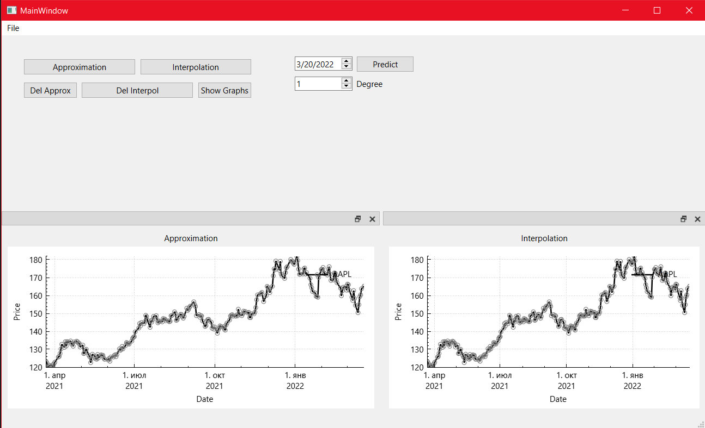

# AlgorithmicTrading

Реализация десктопного приложения для построения графиков вероятностей поведения котировок акций и прогнозов их курсов для обозримого будущего на основе исторических данных. Интерполяция реализована через кубический сплайн и полиномом Ньютона n-ой степени. Аппроксимация через метод наименьших квадратов.

